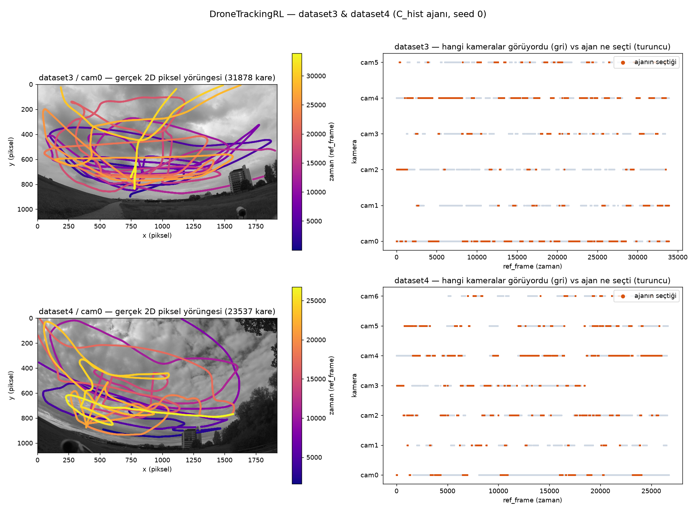
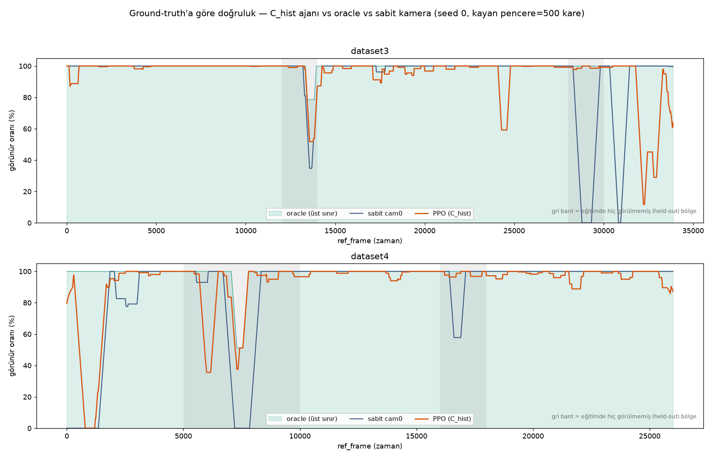

# Deney günlüğü

Bu dosya, tüm gerçek-veri deneylerinin sonucunu — başarılı olsun olmasın — kaydeder.
Amaç: geçersiz/başarısız denemeleri de görünür tutmak, aynı hataya tekrar düşmemek ve
"neden bu tasarımı seçtik" sorusuna geriye dönük cevap verebilmek. Deneyler
`python -m dronetrackingrl.real_data.experiment train ...` ile, sadece önbellekten
(`caches/*.npz`) çalışır; ölçüt her yerde **görünür oranı** (ajanın seçtiği kamerada
drone'un o karede gerçekten görünme yüzdesi, %). Ayrıntılı yöntem/okuma rehberi için
[Rapor (2026-09-21)](https://claude.ai/artifact/3m6Zoe1PMFg2cngrH6ky9W).

Kısaltmalar: **sabit** = en iyi sabit kamera (test verisine bakılarak seçilir, ajana
karşı iyimser bir ölçüt) · **oracle** = etiketleri bilen hayali ajan, aşılamayan üst
sınır · `latent` = sadece encoder çıktısı · `latent+aux` = + 5 nedensel dedektör
özelliği (iz uzunluğu, ateşleme oranı, …) · `gt` = gözlem = etiket (sadece ablasyon).

## Özet tablo

| # | Deney | Gözlem | Eğitim | Test | Sonuç (PPO vs sabit) | Durum |
|---|---|---|---|---|---|---|
| A | ds3 → ds4 | latent | dataset3 tümü | dataset4 1–26000 (görülmemiş) | 85,3 vs 87,8 | ❌ **sabiti geçemedi** |
| B | ds4 → ds3 | latent | dataset4 1–26000 | dataset3 tümü (görülmemiş) | 94,0 vs 94,1 | ⚠️ **eşit** |
| D | ds4 blok bölünmesi (ilk deneme) | latent | ds4 1–4800 + 10201–15800 + 18201–26000 | ds4 24861–31075 | oracle = sabit = 29,9 | 🚫 **geçersiz** — test bölümünde drone hiç yoktu, ölçüm anlamsız |
| D2 | ds4 blok bölünmesi (düzeltilmiş) | latent | aynı (D ile) | ds4 5001–10000 ve 16001–18000 | 76,3 vs 76,5 · 95,8 vs 90,2 | ⚠️/✅ karışık |
| G | gt ablasyonu | **gt** | dataset3 | dataset4 1–26000 | 99,1 = oracle | ✅ **sağlamlık kanıtlandı** (RL düzeneği sorunlu değil) |
| A2 | ds3 → ds4 | latent+aux | dataset3 tümü | dataset4 1–26000 (görülmemiş) | 87,9 vs 87,8 | ⚠️ **eşit** (fark tohum sapması ±0,9 içinde) |
| B2 | ds4 → ds3 | latent+aux | dataset4 1–26000 | dataset3 tümü (görülmemiş) | 94,4 vs 94,1 | ⚠️ **eşit** |
| D3 | ds4 blok bölünmesi | latent+aux | aynı (D2 ile) | ds4 5001–10000 ve 16001–18000 | 85,1 vs 76,5 · 96,6 vs 90,2 | ✅ **sabiti geçti** |
| C | karışık (ds3+ds4) | latent+aux | ds3+ds4'ün ~%80'i (4 blok halinde) | 4 ortak held-out bölge | aşağıda | ✅ **en tutarlı** |
| C3 | sadece ds3 | latent+aux | sadece dataset3 | aynı 4 bölge | aşağıda | ⚠️ **cross-scene'de bir bölgede başarısız** |
| C4 | sadece ds4 | latent+aux | sadece dataset4 | aynı 4 bölge | aşağıda | ✅ iyi |
| C_hist | karışık + kendi geçmişi + geçiş cezası | latent+aux | ds3+ds4 (C ile aynı) | aynı 4 bölge | aşağıda | ✅ **geçiş sayısı 28-118× azaldı, doğruluk aynı/daha iyi** |

## C / C3 / C4 — karışık eğitim gerçekten yardımcı oluyor mu? (2026-09-21, 3 tohum)

Aynı 4 held-out bölgede (eğitimde hiç kullanılmadı, en yakın eğitim ucuna ~200 kare /
~7 sn tampon var), üç farklı eğitim verisiyle test:

| Test bölgesi | Sabit | **C** (ds3+ds4) | C3 (sadece ds3) | C4 (sadece ds4) | Oracle |
|---|---|---|---|---|---|
| ds3 12001–14000 (aynı sahne, C3 için) | 83,7 | 86,7 | 86,8 | 86,2 *(cross-scene)* | 94,7 |
| ds3 28001–30000 (aynı sahne, C3 için) | 65,8 | 99,5 | 99,9 | 99,4 *(cross-scene)* | 100,0 |
| ds4 5001–10000 (aynı sahne, C4 için) | 76,5 | 85,4 | 83,8 *(cross-scene)* | 85,1 | 95,1 |
| ds4 16001–18000 (aynı sahne, C4 için) | 90,2 | 94,8 | **84,1** *(cross-scene)* | 96,6 | 100,0 |

**Bulgu:** cross-scene aktarım tutarlı değil — 3/4 bölgede sabit kamerayı geçiyor
(bazen büyük farkla, ds3 28001–30000'de +33,6 puan), ama **1/4 bölgede sabit kameranın
altına düşüyor** (C3, ds4 16001–18000'de 84,1 vs 90,2 — tek-sahne eğitimin
genellemediği somut bir örnek). **Karışık eğitim (C) bu başarısızlığı büyük ölçüde
düzeltiyor** (84,1 → 94,8, aynı-sahne eğitiminin (C4: 96,6) çoğuna ulaşıyor) ve diğer
3 bölgede de sabit kamerayı geçmeye devam ediyor. Sonuç: **iki sahneyi birlikte
eğitmek, tek-sahne modelinin en kötü durumdaki başarısızlığını gideriyor**, ekstra
maliyeti yok gibi görünüyor.

`ds3 28001–30000` bölgesi ayrıca ilginç: sabit kamera burada çok zayıf (65,8, oracle
100,0 — kamera değiştirmenin gerçekten önemli olduğu bir bölge) ve PPO üç
yapılandırmada da neredeyse tavana ulaşıyor (99,4–99,9). Kamera değiştirmenin işe
yaradığı yerde ajan bunu gerçekten yapıyor.

## C_hist — kendi geçmişi + geçiş cezası (2026-09-22, 3 tohum)

Gözlemlenen sorun: ajan çok sık kamera değiştiriyordu (ör. A'da ~her 2,8 karede
bir) — muhtemelen dedektörün kare-kare titremesine tepki, gerçek durum
değişikliğine değil. İki ekleme yapıldı: **kendi geçmişi** (gözleme "bu kamerayı
az önce seçtim mi" + "kaç adımdır bu kamerada kaldım" eklenir) ve **geçiş
cezası** (kamera değiştirince ödülden 0,1 düşülür, sadece eğitimi etkiler).
`C_hist` = C ile birebir aynı karışık eğitim (ds3+ds4) + bu iki özellik.

| Bölge | Sabit | C (önce) | **C_hist** | Oracle | Geçiş sayısı: C → C_hist |
|---|---|---|---|---|---|
| ds3 12001–14000 | 83,7 | 86,7 | 86,3 ± 1,5 | 94,7 | ~438 → ~12 |
| ds3 28001–30000 | 65,8 | 99,5 | 99,4 ± 0,3 | 100,0 | ~628 → ~5 |
| ds4 5001–10000 | 76,5 | 85,4 | 85,4 ± 0,4 | 95,1 | ~973 → ~35 |
| ds4 16001–18000 | 90,2 | 94,8 | **98,3 ± 0,3** | 100,0 | ~518 → ~11 |

**Sonuç: ✅ net kazanım.** Geçiş sayısı 4 bölgede de 28-118 kat azaldı (artık
~150-380 karede bir değişiyor, önceden 3-5 karede bir). `visible_rate` 3
bölgede tohum sapması içinde aynı, 1 bölgede belirgin iyileşme (94,8 → 98,3,
oracle farkının %67'si kapandı). Hiçbir held-out bölge kötüleşmedi — bedelsiz
bir kazanım. Not: eğitim-içi bir bölgede (ds3 30201–33875, held-out değil) hem
C hem C_hist sabit kameranın altında kalıyor (78,3 → 73,9) — önceden beri var,
bu değişiklikle ilgisi yok, ayrı bir konu.

### C_hist görselleri (seed 0)

**Yörünge + kamera seçimi** — solda cam0 arka planında gerçek 2D piksel yörüngesi
(zamanla renklendirilmiş), sağda hangi kameraların o an drone'u gördüğü (gri) ile
ajanın hangisini seçtiği (turuncu) aynı zaman ekseninde. Turuncu şeritlerin uzun ve
kesintisiz olması, geçiş sayısının 28-118× azaldığını gözle doğruluyor.

**Ground-truth'a göre doğruluk** — 500 karelik kayan pencerede görünür oranı: PPO
(turuncu) vs oracle/üst sınır (yeşil dolgu) vs sabit cam0 (lacivert), sadece gerçek
etiketten. Gri bantlar eğitimde hiç görülmemiş test bölgeleri. dataset3'ün sonundaki
(~30000-34000) zayıf bölge (bkz. TRAIN_EXTRA2 notu yukarıda) burada gözle görülüyor.

## Bilinen sınırlamalar (henüz çözülmedi)
- "Sabit kamera" test verisinden seçiliyor → ajana karşı iyimser bir ölçüt.
- Tek sahne çifti (dataset3, dataset4), tek bölünme seti; güven aralığı yok.
- Dedektör dataset4'te zayıf (cam0 duyarlılık 0,39, cam6 kesinlik 0,37) — bkz. rapor.
- dataset1/2 (senkronizasyon tablosu yok) ve dataset5 (2D etiket yok) hâlâ kullanılamıyor.
